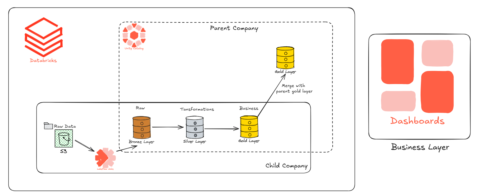

# FMCG Data Engineering Pipeline — Lakehouse Architecture on Databricks

## Overview

This project simulates a real-world scenario in the FMCG (Fast-Moving Consumer Goods) industry: a large retail company acquires a smaller competitor and needs to consolidate data from both entities into a single, unified system.

The goal was to build a production-style, end-to-end ETL pipeline that ingests raw data from both companies, resolves inconsistencies, and delivers clean, analytics-ready datasets — all on a Lakehouse architecture using Databricks and Amazon S3.

This project was built as part of the Codebasics Data Engineering course by Dhaval Patel.

---

## Architecture



The pipeline is structured around the **Medallion Architecture** and follows a two-company consolidation design.

The child company runs a full, self-contained pipeline: raw data is ingested from Amazon S3 into a Bronze layer, transformed through a Silver layer, and aggregated into its own Gold layer. That Gold layer is then merged into the parent company's Gold layer, which is managed under **Unity Catalog**. The unified Gold layer is what powers the Databricks dashboards.

Orchestration across the entire flow is handled by **Lakeflow Jobs**.

```
                        ┌─────────────────────────────────┐
                        │         Parent Company           │
                        │                                  │
                        │   Unity Catalog                  │
                        │        │                         │
                        │        ▼                         │
                        │   ┌─────────┐                   │
                        │   │  Gold   │ ──► Dashboards     │
                        │   └────▲────┘                   │
                        │        │ Merge                   │
                        └────────┼────────────────────────┘
                                 │
┌────────────────────────────────┼────────────────────────┐
│  Child Company                 │                         │
│                                │                         │
│  S3 (Raw Data)                 │                         │
│      │                         │                         │
│      ▼                         │                         │
│  Lakeflow Jobs                 │                         │
│      │                         │                         │
│      ▼        ▼        ▼       │                         │
│  [Bronze] → [Silver] → [Gold] ─┘                         │
│   Raw      Transform  Business                           │
└──────────────────────────────────────────────────────────┘
```

### Layer Breakdown

**Bronze — Raw Ingestion**
Raw data from the child company is landed into Amazon S3 and ingested into the Bronze layer as-is, preserving the original state for auditability and reprocessing.

**Silver — Transformation & Standardization**
Data is cleaned, validated, and standardized at this layer. This includes resolving schema differences, inconsistent formats, and duplicate records introduced by operating as a separate company.

**Gold (Child) — Business-Ready**
Aggregated and enriched datasets are produced for the child company's data, structured to be compatible with the parent company's schema.

**Gold (Parent) — Unified Analytics Layer**
The child company's Gold data is merged into the parent company's Gold layer, managed via Unity Catalog. This unified layer is the single source of truth for all reporting and dashboards.

---

## Tech Stack

| Tool / Technology       | Purpose                                      |
|-------------------------|----------------------------------------------|
| Databricks              | Processing, orchestration, and dashboards    |
| Apache Spark            | Distributed data transformation              |
| Amazon S3               | Raw and processed data storage               |
| Unity Catalog           | Data governance and catalog for parent company|
| Lakeflow Jobs           | Pipeline scheduling and orchestration        |
| Python                  | Pipeline logic and transformations           |
| SQL                     | Data querying and aggregation                |
| Medallion Architecture  | Layered data organization pattern            |

---

## Pipeline Workflow

1. Raw data from both companies is uploaded to Amazon S3
2. Databricks ingests the raw files into the Bronze Delta tables
3. Spark jobs clean and standardize the data into the Silver layer
4. Business logic is applied to produce unified Gold tables
5. Databricks dashboards connect to the Gold layer for reporting
6. The entire pipeline runs on a scheduled Databricks Workflow

---


## Getting Started

### Prerequisites

- A Databricks workspace (Community Edition works for exploration)
- An Amazon S3 bucket with appropriate IAM permissions
- The raw dataset files loaded into S3

### Steps

1. Clone this repository
2. Import the notebooks into your Databricks workspace
3. Configure your S3 connection in the Databricks cluster settings (or via a mounted storage path)
4. Run the notebooks in order: Bronze → Silver → Gold
5. Set up a Databricks Workflow to automate the pipeline on a schedule
6. Connect the Databricks dashboard to the Gold layer tables

---

## Business Use Case

This pipeline enables the acquiring retail company to:

- Get a unified, consistent view of customers, sales, and inventory across both companies
- Identify data quality issues introduced by the acquisition early in the pipeline
- Support finance, operations, and leadership with reliable, up-to-date reporting
- Scale the pipeline as more data sources are added post-acquisition

---

## Acknowledgements

Built as part of the [Codebasics Data Engineering course](https://codebasics.io) by Dhaval Patel.
